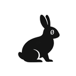

## Hey, I'm TheNullRabbit 👋

- I’m a Cloud ☁️ & DevOps ♾️ Engineer specializing in Azure.
- I design 📐 and build 🏗️ end-to-end, reliable, scalable cloud-native applications on Azure using Java, Spring Boot, Docker, Terraform, and Kubernetes.
- My focus 🎯 is on infrastructure automation, platform engineering, and MLOps.
- I’m driven 🚀 by continuous learning and disciplined execution.

## Tech Stack

## Connect

